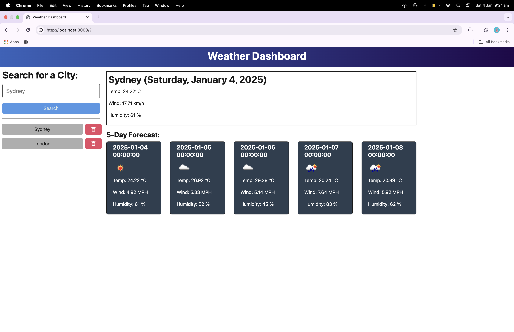

# weather-dashboard-2

## Table of Contents

- [Description](#description)
- [Installation](#installation)
- [Usage](#usage)
- [License](#license)
- [Contributing Guidelines](#contributing-guidelines)
- [Testing](#testing)
- [Authors and Acknowledgements](#authors-and-acknowledgements)

## Description

A weather dashboard application in typescript that calls the OpenWeather API and renders data in the browser.

## Installation

1. Create package.json for serevr directory and install dependencies:

```zsh
npm install dayjs dotenv express uuid node-fetch
npm install nodemon typescript @types/dotenv @types/express @types/node @types/uuid --save-dev
```
Add the following scripts:

```javascript
"scripts": {
    "start": "npm run build && node dist/server.js --ignore client",
    "dev": "npx nodemon"
  }
```

2. In root directory create .gitignore file and add:

node_modules
.env

3. In server directory create .env file:

```javascript
API_BASE_URL=https://api.openweathermap.org/data/2.5/forecast?lat={lat}&lon={lon}&appid={API key}
API_KEY=
```

5. In server directory, create the following folders:
- `db`
- `src/routes/api`
- `src/routes/htmlRoutes.ts`
- `src/routes/index.ts`
- `src/service/historyService.ts`
- `src/service/weatherService.ts`

6. In server.ts, define routes and middleware:

```typescript
app.use(routes);
app.use(express.json());
```

7. In client directory, initialize a new Vite + React project:

```zsh
cd client
npm create vite@latest
```
8. In client directory, install dependancies:

```zsh
cd interstitial-vite
npm install
npm run dev
```

9. In client directory, install Tailwind CSS and its dependancies:

```zsh
npm install -D tailwindcss postcss autoprefixer
```
10. In client directory, initialise Tailwind CSS:

```zsh
npx tailwindcss init -p
```
11. Update tailwind.config.js file to specify the paths to template files:

```javascript
export default {
      content: [
        "./index.html",
        "./src/**/*.{js,ts,jsx,tsx}",
      ],
      theme: {
        extend: {},
      },
      plugins: [],
    }
```

12. Create a CSS file src/index.css and add @tailwind directives:

```css
@tailwind base;
@tailwind components;
@tailwind utilities;
```
13. In client directory delete App.css and vite.svg.

14. In `client/src`, create the following folders:
- `components` 
- `context`
- `hooks`
- `pages`
- `routes`
- `utils` 

15. In client directory, install:

```zsh
npm install react-router-dom @tailwindcss/forms @tailwindcss/line-clamp
```


## Usage

Link to render deployment:

[weather-dashboard-2](https://weather-dashboard-2.onrender.com/)

Screenshots of app demonstrating functionality:

### screenshot-1



### screenshot-2


### screenshot-3


### screenshot-4


### screenshot-5


### screenshot-6


## License

[](https://opensource.org/licenses/MIT)

## Contributing Guidelines

Create a new branch for the commit and start a pull request.

## Testing

## Authors and Acknowledgements

[email] (ginadrcoder@gmail.com)


## Questions

For enquiries, please contact me at:

[email] (ginadrcoder@gmail.com)

[github] (https://github.com/gina-t)

